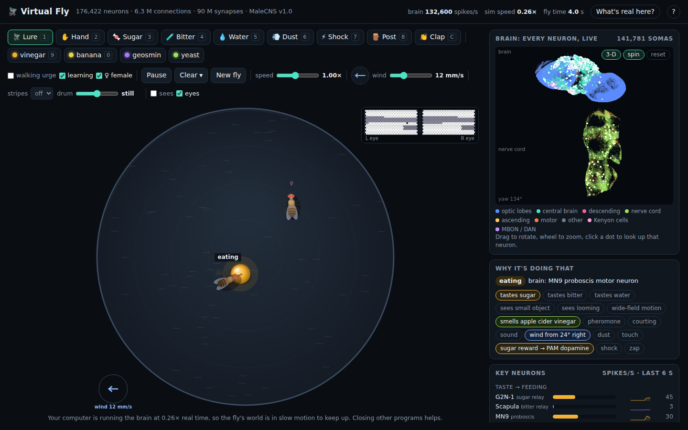

# Virtual Fly

A whole-nervous-system fruit fly you can play with. It simulates the complete wiring diagram of a
male fruit fly's central nervous system (every neuron in its brain, optic lobes and nerve cord:
176,422 neurons, 6.3 million connections) and connects it to a little fly in a petri dish that
sees, smells, tastes, hears, feels the wind, learns, courts, and runs away.

It needs Python and one library (NumPy). There is nothing to train, and nothing runs in the cloud.



```
fly_game.py        play: a local web server with the arena, the senses and the body
fly_brain.py       experiment: run the validated protocols, poke neurons, trace wiring routes
my_first_fly.py    the smallest possible experiment (start here if you want to write code)
virtual_fly/       the code (docs/ARCHITECTURE.md is the map)
docs/SCIENCE.md    what was measured on the real connectome, and why the kit is built the way it is
docs/API.md        the game's HTTP API, for driving the fly from your own program
tests/             a test suite that runs on a small synthetic connectome (no download needed)
data/              the connectome, downloaded automatically the first time (23 MB)
```

---

## 1. What this is

On **3 September 2026**, HHMI Janelia, the University of Cambridge and Google Research published the
first complete connectome of a male fruit fly's central nervous system, "MaleCNS v1.0", in *Cell*.
Within a day people were wiring it into Minecraft, Doom, Beat Saber and a car simulator. The
neuroscientists' reality check was that most of those demos never closed a real
sensation-to-action loop: they fed noise into the network and mapped a few neurons to buttons.

This kit is built around the honest version, following Shiu et al. (*Nature*, 2024): specific
sensory inputs, the real wiring, specific output neurons, and every hand-built part labelled.
Compared with the small starter it grew from, it adds:

| | what it does | comes out of the wiring? |
|---|---|---|
| **A retina** | two compound eyes render what the fly sees; looming, small moving objects and wide-field motion are computed from the images, and the connectome's own T4/T5 motion-detector columns are driven facet by facet | the escape (LC4/LPLC2 → giant fibre), the chase (LC10a → DNa02) and the optomotor reflex (T4/T5 → HS → DNp15/DNa02) are wiring; the retina and feature computations are hand-built |
| **Smell** | odour sources release turbulent plumes carried by the wind; each odour drives its own set of glomeruli | a sparse, odour-specific Kenyon-cell code (7-9 % of cells) and MBON responses are wiring |
| **Learning** | dopamine-gated depression of Kenyon-cell → MBON synapses, the fly's actual learning rule; pair an odour with sugar, bitter or shock and its preference changes | which synapses are plastic and which dopamine neurons gate which MBON come from the wiring; bitter → punishment dopamine is wiring; sugar → reward dopamine is injected (labelled); the rule's constants are hand-chosen |
| **A second fly** | a scripted female to chase, tap and sing to | the chase and the song (pC1 → pIP10 → wing motor neurons) are wiring; her behaviour and the contact-to-pC1 arousal are hand-built |
| **Wind, sound, touch** | Johnston's organ senses wind direction and sound; a clap can make the fly jump | sound → giant fibre and wind → grooming are wiring; heading upwind is hand-built |
| **Internal state** | hunger and thirst rise with time and change what the fly does and tastes | hand-built |
| **A better model** | short-term synaptic depression, background noise, per-population output modulation, threshold heterogeneity, checkpoints, spike recording, rate monitors, a `--fast` 1 ms step; the integrator itself is the starter's (same speed, identical spikes) | the mechanisms are documented physiology; the parameters are chosen by hand |
| **Tools** | a pathway tracer ("how does the eye reach the steering neurons?"), lesion scans, dose-response sweeps, seeds, JSON export, scenarios (conditioning protocols, courtship, plume following, escape), a 3-D brain map, an event log, session recording | analysis, not model |

Everything on screen says which of the two it is; the **"What's real here?"** button lists it all.

## 2. Setup

1. Install **Python 3.10 or newer** from [python.org](https://www.python.org/downloads/). On Windows,
   tick **"Add python.exe to PATH"** in the installer.
2. Unzip or clone this folder, open a terminal in it (Windows: click the File Explorer address bar,
   type `cmd`, press Enter).
3. Install NumPy:
   ```
   py -m pip install numpy            # macOS / Linux: python3 -m pip install numpy
   ```
4. Check the brain works (downloads the data the first time, then runs the validated experiments):
   ```
   py fly_brain.py --profile game
   ```
5. Play:
   ```
   py fly_game.py
   ```
   Your browser opens the game. Keep the terminal window open; press `Ctrl+C` in it to quit.

On macOS or Linux, use `python3` instead of `py`. To install the package with its console scripts
and the test tools: `pip install -e ".[dev]"` then `fly-game`, `fly-brain`, `pytest`.

**If something goes wrong**

| Problem | Fix |
|---|---|
| `'py' is not recognized` | Python isn't on PATH: re-run the installer and tick "Add python.exe to PATH" (or use `python`). |
| Download fails with a certificate error (macOS) | Run "Install Certificates.command" in your Python folder in Applications. |
| Download blocked by a firewall | Download [the file](https://raw.githubusercontent.com/blendi-remade/fly-brain-minecraft/6cfa30175003ef25da68a237d5eda958f8047b82/src/main/resources/connectome/malecns-v1.0.flyb.gz) in your browser and put it in `data/`. |
| "Could not find a free port" | `py fly_game.py --port 9000` |
| The game says it's running below real time | Your computer is simulating 176k neurons slower than real time; the fly's world slows down to keep up. Close other programs, or start it with `py fly_game.py --fast` (a 1 ms time step, about twice as fast; every classic experiment still passes) or `--no-columnar` (fewer visual neurons driven). |

## 3. How it works (the whole idea)

```
  things in the dish ──(senses: hand-built)──> sensory neurons
                                                     │
                                          the connectome: 176,422 neurons,
                                          6.3 million connections (nobody designed this part)
                                          + the mushroom body's learning rule
                                                     │
  the fly moves <──(body: hand-built)── descending neurons ("command" cables from brain to body)
```

1. **The wiring diagram.** For every pair of connected neurons, the connectome says how many synapses
   link them. This kit keeps the 6.3 million connections with 5 or more synapses (90 million synapses).
2. **Every neuron is the same simple unit.** Its voltage leaks back toward rest, jumps up or down when
   an input neuron fires, and when it crosses a threshold it fires a spike and resets ("leaky
   integrate-and-fire"). A spike from a neuron that uses acetylcholine pushes its targets up; one
   using GABA or glutamate pushes them down. The kick is proportional to the synapse count. These
   are the exact equations and parameters of Shiu et al. 2024 (0.275 mV per synapse, 20 ms leak,
   1.8 ms delay), with a gain of 0.65 because the male connectome has more synapses per neuron.
3. **Senses.** To make the fly taste sugar, the program makes the real sugar-sensing neuron types
   (`LB3b`, `LB3c`, ...) fire at random at about 120 spikes per second, as the paper does. To make it
   see, it renders two compound eyes and drives the real motion detectors and feature detectors
   from the images. To make it smell, it samples the plume at the antennae and drives the receptor
   neurons of the odour's glomeruli.
4. **Actions.** The program listens to descending neurons, the ~1,300 neurons that carry commands
   from the brain to the body, and turns their firing into movement: `MN9` extends the proboscis,
   `DNp01` (the giant fibre) triggers an escape jump, `DNa02` left vs right steers, `DNp15` carries
   the optomotor reflex, `MDN` walks backward, `pIP10` sings, and so on.
5. **Learning.** Every synapse from a Kenyon cell onto a mushroom body output neuron (33,496 of them)
   weakens when the Kenyon cell was active shortly before dopamine arrived in that MBON's
   compartment. Punishment dopamine (PPL1) waters the approach-promoting MBONs, reward dopamine
   (PAM) the avoidance-promoting ones, so odour + punishment makes the fly avoid the odour and
   odour + reward makes it approach. Which dopamine neurons gate which MBON is read from the wiring.

With no input, the brain is completely silent: every spike you see traces back to something the fly
sensed, something you zapped, or the faint background noise if you switch it on.

## 4. What it does, and how it was checked

`py fly_brain.py` runs the classic experiments and compares them with published results. These are
the numbers from this kit, every neuron simulated, nothing tuned for these tests (seed 0; the
"pure" profile is the paper's model, the "game" profile is what the game runs):

| Experiment | Neuron listened to | pure | game | Expected |
|---|---|---|---|---|
| No input | the whole brain | 0 | 0 | silence |
| Sugar on the mouthparts | MN9, proboscis motor neuron | 69 Hz | 47 Hz | 30-90 Hz |
| Bitter taste | Scapula (bitter relay) / MN9 | 287 / 0 Hz | 225 / 0 Hz | relay fires, MN9 silent |
| Sugar and bitter together | MN9 | 0 Hz | 0 Hz | bitter wins |
| Something looming on the right | DNp01 giant fibre / TTMn jump motor neuron | 343 / 68 Hz | 293 / 58 Hz | 250-400 / 40-100 Hz |
| Dust on the antennae | aDN1 / aDN2 grooming neurons | 192 / 139 Hz | 144 / 106 Hz | 100-260 / 80-200 Hz |
| 1 s after bitter or dust stops | the whole brain | runaway loop | calm | calm |

Scanning hundreds of sensory cell types on the real connectome (the experiments are in
`docs/SCIENCE.md`) found what else the wiring supports, and what it does not:

- **Vision.** Driving the connectome's own T4/T5 motion detectors, column by column from the
  retina, gives a direction-selective optomotor reflex: front-to-back motion on the right eye makes
  the right HS cells fire, and through them `DNp15` and `DNa02` on the right, so the fly turns with
  a rotating striped drum. The same input reaches the looming detector `LPLC2` only weakly and
  `LC10a` (small objects) not at all, so those are computed from the retinal image and injected.
- **Smell and learning.** Once the antennal lobe is calm, an odour that excites four or five
  glomeruli activates 7-9 % of Kenyon cells, the same cells every time and different cells for
  different odours (overlap 0.00-0.02 between odours with no shared glomerulus, 0.9 across random
  seeds). Halving the Kenyon-cell synapses onto the punishment-side MBONs cuts their odour response
  (MBON11 31 → 14 Hz, MBON14 26 → 3 Hz) without touching an unpaired odour. Bitter taste fires the
  PPL1 punishment dopamine neurons (PPL101 at 91 Hz); sugar never reaches the PAM reward neurons in
  this model, so eating sugar drives them directly, and the game says so.
- **Courtship.** `pC1` at 60 Hz drives `pIP10` at 80 Hz and the wing motor neurons of song. The
  tarsal taste neurons that should carry the female's pheromone to `pC1` are about eight times too
  weak in this model, so tapping the female fires them (wiring) *and* drives `pC1` directly
  (hand-built, labelled).
- **Hearing and wind.** Johnston's organ B neurons at 100 Hz drive the giant fibre at 65 Hz: a
  clap makes the fly jump. The wind-sensing C/E neurons drive grooming and backing at rates above
  ~30 Hz and no steering neuron at any rate, so wind is kept weak and heading upwind is hand-built.
- **Brakes.** The paper's model locks into runaway firing after bitter, dust or any odour. Mild
  fatigue plus blocking the output of the 420 antennal-lobe local neurons (many are non-spiking in
  real flies) ends it while keeping every readout in range. Textbook short-term synaptic depression
  starves the calibrated sensory drive instead, so it is offered only as the `brakes` profile.

## 5. Things to try

**In the game** there is a checklist: feed it, offer bitter food, lure it, scare it, dust it, watch
it bump a wall, drop an odour, teach it, add a female, turn on the wind, clap, spin the drum, zap
MDN, silence MN9. The **scenarios** run whole protocols for you: appetitive conditioning (odour +
sugar, then a preference test), aversive conditioning (odour + shock), courtship, following a
plume upwind, and three hand swoops. The **Neuron lab** zaps, silences or scales any cell type by
name and adds it to the readouts; the **Pathway explorer** asks the wiring how one population
reaches another and highlights the route in the 3-D brain map, with a one-click lesion of each
relay. The **Learning** panel shows every MBON's remaining synaptic strength and the learned bias
for the odour being smelled. **Record** saves the session (and, optionally, every spike).

**In code**, start with `my_first_fly.py`: poke, wait, listen, in three lines. Then:

```
py fly_brain.py --find LC10                                # search cell types by name
py fly_brain.py --stim "MDN:60" --watch "MDN,DNp09"        # zap a type, listen to others
py fly_brain.py --stim "LC4/R,LPLC2/R:150"                 # no --watch: shows the most active types
py fly_brain.py --trace LC10a/L DNa02/L                    # the strongest wiring routes, with signs
py fly_brain.py --inputs MN9 --outputs GNG232              # strongest partners of a population
py fly_brain.py --sweep "LB3b,LB3c:0:200:9" --watch MN9    # a dose-response curve
py fly_brain.py --lesion Sugar --readout MN9               # which relays does sugar → MN9 need?
py fly_brain.py --profile game --seeds 3 --json out.json   # mean ± sd over seeds, saved
py fly_brain.py --silence GNG087 --only bitter             # knock out the bitter relay
py fly_brain.py --stim "prefix:JO-B:100" --record spikes.npz   # every spike, with neuPrint IDs
py fly_game.py --pure                                      # the paper's model, seizures and all
py fly_game.py --noise 2:1                                 # a little spontaneous activity
```

```python
from virtual_fly import load_connectome, trace
from virtual_fly.settings import build_brain

brain = build_brain(load_connectome(), "game")          # what the game runs, plasticity included
for path in trace(brain.conn, "LC10a/L", "DNa02/L"):    # ask the wiring diagram
    print(path.describe())
brain.stimulate("ORN_DM1,ORN_DM4,ORN_VM7d,ORN_DP1m", 80) # the smell of vinegar ...
brain.stimulate("prefix:PPL1", 80)                       # ... paired with punishment
brain.run(2000)
print(brain.plasticity.summary()["MBON11"])              # its Kenyon-cell synapses are weaker now
```

Every neuron keeps its official ID, so you can look anything up at
[neuPrint](https://neuprint.janelia.org/?dataset=male-cns%3Av1.0) (dataset `male-cns:v1.0`); the
game's brain map links straight to it.

**From another program.** While `fly_game.py` runs it serves the fly as JSON: `GET /api/state` (or
the `/api/stream` event stream) returns the fly's position, heading, behaviour, senses, neuron
rates and learning state, and `POST /api/action` accepts commands such as
`{"type": "zap", "spec": "MDN", "hz": 60}`, `{"type": "drop", "kind": "vinegar", "x": 10, "y": 5, "food": "sugar"}`
or `{"type": "stripes", "count": 16, "drum_speed": 1.5}`. `docs/API.md` has the whole contract; anything
that can make HTTP requests (a game engine, a notebook, a robot) can drive a fly from it.

## 6. Honest limitations

These are the things the critics point at, so it's worth knowing them:

- **Every neuron is identical.** Real neurons differ in size, threshold, timing and chemistry. The
  absolute firing rates shouldn't be trusted, only which neurons respond. (`--jitter` adds
  threshold heterogeneity if you want to see how fragile the numbers are.)
- **Runaway loops.** In the paper's pure model, bitter taste, dust and smells set off a seizure in
  the antennal lobe that never stops. The game's fixes are documented above; `--pure` shows the
  model without them. A small loop between `DNg33` and a few serotonin neurons can still keep
  firing after strong stimuli; it doesn't move the body.
- **Dopamine is treated as a slow modulator.** The data label dopamine neurons excitatory; in the
  game their spikes gate plasticity but their fast synapses are muted, otherwise bitter taste would
  drive the MBONs directly.
- **No spontaneous activity**, unless you switch on the (hand-built) background noise. The
  "walking urge", hunger, thirst and odour-guided steering are hand-built and can be switched off.
- **Vision is computed, not grown.** The retina, the feature detectors and the correlator are our
  code; only the T4/T5 columns onward are the fly's. The photoreceptor-to-motion-detector
  circuit (L1/L2, Mi1, Tm3...) is in the data but has no resting activity to modulate in this model.
- **The odour code is odd in places.** Kenyon-cell subtypes are recruited unlike real flies (γ-main
  cells hardly at all), single glomeruli barely reach the mushroom body, and an odour leaves the
  central-complex heading circuit ringing for a second or two after it stops.
- **The body is a drawing.** No legs, muscles or physics; speeds and turn rates are chosen by hand.
  The decoder's weights are hand-chosen too, but it measures and shows which motor pools each
  descending neuron reaches in the wiring.
- **No hormones, no electrical synapses, no development,** one fly's brain, one seed unless you ask
  for more. Nothing here is conscious. It is a wiring diagram with the simplest possible physics,
  and it still does a surprising number of fly things.

## 7. Where to go next

- **Add a sense or a behaviour.** Find the neurons (with `--find`, `--stim`, `--trace` or on
  neuPrint), add an encoder in `virtual_fly/senses/`, a readout in `game.py`'s `READOUTS`, and a
  line in the decoder. Scanning inputs and watching `DNa02` is exactly how the lure was found;
  scanning T4/T5 columns is how the optomotor reflex was found.
- **A real body:** [FlyGym / NeuroMechFly](https://github.com/NeLy-EPFL/flygym) and
  [flybody](https://github.com/TuragaLab/flybody) are physics-simulated fly bodies (MuJoCo).
- **Real vision:** [flyvis](https://github.com/TuragaLab/flyvis) has connectome-based models of the
  fly's visual system that compute motion from photoreceptors up.
- **More projects:** [awesome-fly](https://github.com/cobanov/awesome-fly) lists dozens; the
  explainer ["Deconstructing viral fly sims"](https://www.neuroai.science/p/are-flies-playing-beat-saber)
  is the best overview of what works and what doesn't.

## 8. Credits and data licence

- **Connectome:** Berg S, Beckett IR, Costa M, Schlegel P, Januszewski M, et al. *Sexual dimorphism in
  the complete Drosophila male central nervous system connectome.* Cell 189(18):5504-5526 (2026),
  [doi:10.1016/j.cell.2026.08.015](https://doi.org/10.1016/j.cell.2026.08.015). HHMI Janelia FlyEM,
  University of Cambridge / MRC LMB, Google Research. Licensed
  [CC BY 4.0](https://creativecommons.org/licenses/by/4.0/). Project site:
  [male-cns.janelia.org](https://male-cns.janelia.org/).
- **Neuron model:** Shiu PK, et al. *A Drosophila computational brain model reveals sensorimotor
  processing.* Nature 634:210-219 (2024), [doi:10.1038/s41586-024-07763-9](https://doi.org/10.1038/s41586-024-07763-9).
- **Learning rule:** Aso Y et al., eLife 2014 (MBON valence, compartments); Hige T et al., Neuron
  2015 and Handler A et al., Cell 2019 (dopamine-gated depression). **Vision:** Klapoetke NC et al.,
  Nature 2017 (LPLC2); Ache JM et al., Neuron 2019 (LC4); Ribeiro IMA et al., Cell 2018 (LC10a);
  Maisak MS et al., Nature 2013 (T4/T5 directions); Kim AJ, Fitzgerald JK, Maimon G, Nat Neurosci
  2015 (efference copy). **Other senses:** Hampel S et al., eLife 2015 (grooming); Suver MP et al.,
  Neuron 2019 (wind); Nagel KI, Wilson RI, Nat Neurosci 2011 (olfactory adaptation). Full list in
  `docs/SCIENCE.md`.
- **Data file and calibration:** the compact connectome file (connections with 5+ synapses, fetched
  from neuPrint), the gain of 0.65, the Kenyon-cell input scaling and many of the sensory and motor
  neuron choices come from [fly-brain-minecraft](https://github.com/blendi-remade/fly-brain-minecraft)
  by blendi-remade (code MIT, data CC BY 4.0). The download is pinned to one version and checked
  with a SHA-256 hash.
- **This kit's code** is yours to use and change however you like.
